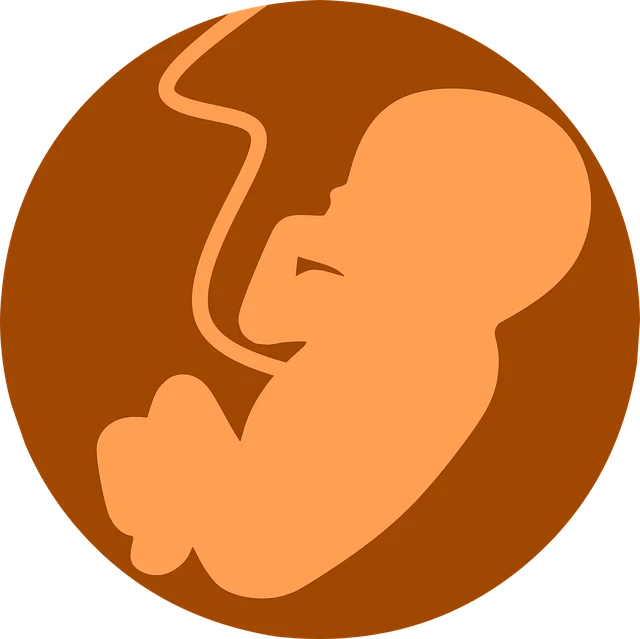
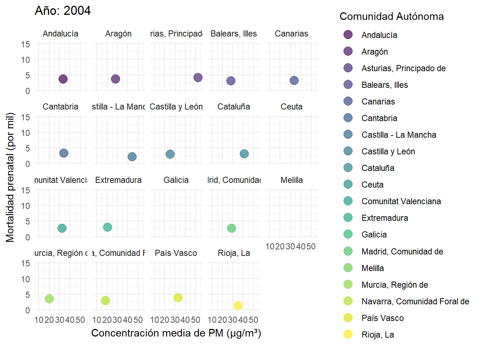
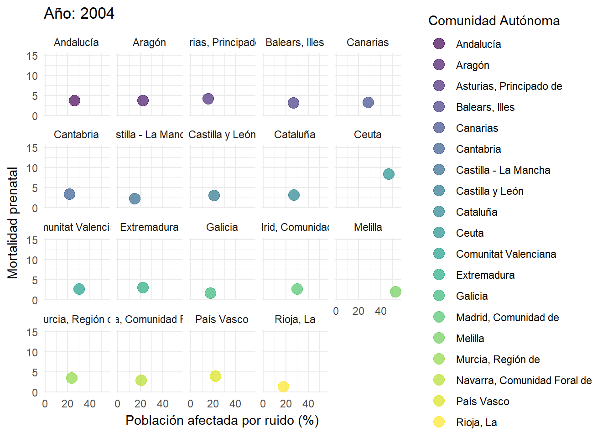

 
 
# Contaminación y muerte prenatal          
  
En este seminario trataremos de demostrar si existe una relación entre las muertes prenatales en España con la contaminación del aire y contaminacion acústica en las distintas comunidades autónomas, consultando diferentes bases de datos y sacando conclusiones.

## Objetivos

El objetivo principal es demostrar si la contaminación del aire y la exposición al ruido pueden estar asociados con el número de casos de mortalidad fetal, a través de:

  - Analizar la concentración de PM 2.5 y PM 10 en el aire por comunidad autónoma.
  - Estudiar la relación entre la calidad del aire y mortalidad prenatal.
  - Analizar el porcentaje de población afectada por exceso de ruido en cada CCAA.
  - Estudiar la relación entre el exceso de ruido y mortalidad prenatal.

## Resultados

 - Relación entre la calidad del aire y mortalidad prenatal:

   
   
 - Relación entre el exceso de ruido y mortalidad prenatal:

   

## Conclusiones

   
***
Autores: Álvar Martínez e Iván Mamolar
