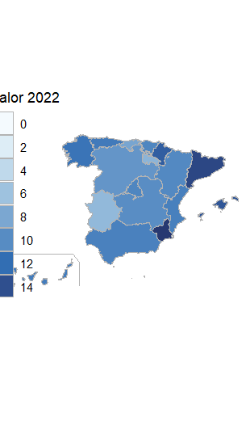

<style>
body {
text-align: justify}
</style>

```{r setup, include=FALSE}
knitr::opts_chunk$set(echo = TRUE)
```

* [Repositorio de GitHub](https://github.com/ivanmr200/seminario_fuentes) 

## Introducción


La **mortalidad prenatal** se refiere a aquellos bebés que fallecen pasadas las 28 semanas de embarazo (a partir del séptimo mes) y que no llegan a término.
Las pricipales causas son las complicaciones que surgen durante el embarazo ya sean por infecciones como sífilis o VIH, otros tipos de anomalías maternas, como diabetes o hipertensión o hábitos perjudiciales como el consumo de tabaco o el alcohol.

Además de estos factores, las condiciones ambientales pueden tener un efecto negativo en el embarazo. Estudios sugieren que la presencia de contaminantes en el aire pueden causar complicaciones en el embarazo e incluso aumentar la probabilidad de partos prematuros, así como la exposición al ruido puede tener efectos adversos para el embarazo pudiendo llegar a afectar a la mortalidad prenatal. 

En este seminario, vamos a tratar de demostrar si estos estudios se cumplen en las distintas comunidades autónomas españolas, analizando la relación que hay entre la **calidad del aire** y la **contaminación acústica** con la mortalidad prenatal.


## Objetivos

El objetivo principal es demostrar si la contaminación del aire y la exposición al ruido pueden estar asociados con el número de casos de mortalidad fetal, a través de:

  - Analizar la concentración de PM 2.5 y PM 10 en el aire por comunidad autónoma.
  - Estudiar la relación entre la calidad del aire y mortalidad prenatal.
  - Analizar el porcentaje de población afectada por exceso de ruido en cada comunidad autónoma.
  - Estudiar la relación entre el exceso de ruido y mortalidad prenatal.


## Metodología

Los datos que vamos a utilizar han sido encontrados en la página oficial del Instituto Nacional de Estadística (INE) en el que se pueden encontrar una gran cantidad de datos de diferentes formatos como XLS, csv, JSON ... En nuestro caso los datos sobre mortalidad prenatal y contaminación son de fromato csv y JSON y se encuentran en la carpeta `DATA` dentro de la carpeta `Input` del repositorio.

Para poder utilizar estos conjuntos de datos son necesarios importarlos, para ello utilizaremos las siguientes librerías:

```{r , eval = TRUE,message=FALSE}
# Datos con formato .csv:
library(readr)

#Datos con formato .json:
library(tidyverse)
library(rjson)
library(tidyjson)

#Visualizacion resultados:
library(DT)

```

### Importación archivos

Una vez cargadas las librerías se pueden importar los datos. 

#### Importación datos CSV:

En algunos de nuestros archivos csv, es necesario especificar el tipo de codificación que tienen, para que R pueda leer correctamente los caracteres especiales como *tildes* o *ñ*. En nuestro caso utilizan la codificacion *ISO 8859-1* que corresponde con el alfabeto español :

```{r , eval = TRUE,message=FALSE}

# Para conocer el tipo de codificación: 
encoding <- guess_encoding("Input/DATA/media_anual_PM2_5.csv")
print(encoding)

```

```{r , eval = TRUE,message=FALSE}

PM2_media <- read_delim("Input/DATA/media_anual_PM2_5.csv", 
                        delim = ";", escape_double = FALSE, trim_ws = TRUE, 
                        locale = locale(encoding = "ISO-8859-1"))

PM10_media <- read_delim("Input/DATA/media_anual_PM10.csv", 
                        delim = ";", escape_double = FALSE, trim_ws = TRUE, 
                        locale = locale(encoding = "ISO-8859-1"))

RUIDO_media <- read_delim("Input/DATA/poblacion_sufre_ruidos.csv", 
                         delim = ";", escape_double = FALSE, trim_ws = TRUE)

```

#### Preparación datos csv

Los datos en los archivos csv estan distribuidos de tal forma que puede dificultar su comprensión y manejo, por ello vamos a modificarlos y ordenarlos.

El objetivo es conseguir que los años (*periodo*), que de forma predeterminada vienen en una única columna pasen a ser las columnas del dataframe y el nombre de las comunidades autónomas las filas. Además, eliminar aquellas columnas y filas que no son de nuestro interés.

```{r , eval = TRUE,message=FALSE}
# Datos concentración anual PM 2.5
PM2_ccaa_media <- PM2_media %>%
  pivot_wider(names_from = periodo, values_from = Total)%>% 
  select(-`Total Nacional`)%>% #Eliminar columna Total Nacional
  slice(-1)                    #Eliminar fila Total Nacional

datatable(PM2_ccaa_media)
```


```{r , eval = TRUE,message=FALSE}
# Datos concentración anual PM 10
PM10_CCAA_media <- PM10_media %>%
  pivot_wider(names_from = periodo, values_from = Total)%>%
  select(-`Total Nacional`)%>%
  slice(-1)
datatable(PM10_CCAA_media)

```


```{r , eval = TRUE,message=FALSE}
#Datos población afectada por ruidos
RUIDO_CCAA_media <- RUIDO_media %>%
  pivot_wider(names_from = periodo, values_from = Total)%>%
  select(-`Total Nacional`)%>%
  slice(-1)  
datatable(RUIDO_CCAA_media)

```


#### Importación datos JSON:

```{r , eval = TRUE,message=FALSE}

mort_prenatal <- fromJSON(file = "INPUT/DATA/mortalidad_prenatal_total.json")

mort_prenatal %>% 
  spread_all()

```

#### Preparación archivos .json

Una vez que hemos importado el archivo json, analizamos los tipos de los atributos que lo forman para quedarnos con aquellos de tipo *array* que son  los que contienen la información que queremos:

```{r , eval = TRUE,message=FALSE}

mort_prenatal %>% 
  gather_object %>% 
  json_types %>% 
  count(name, type)

```
En nuestro caso queremos estudiar la mortalidad prentala tanto en hombres como en mujeres, para ello filtramos eliminando las columnas de hombres y mujeres, quedandonos con las de ambos sexos:


```{r , eval = TRUE,message=FALSE}

filter <- c()
for (i in 1:60){
  filter <- append(filter, mort_prenatal[[i]]$MetaData[[4]]$Nombre == "Ambos sexos")
}
elim = 0
for (i in 1:60){
  if(!filter[i]){
    mort_prenatal[[i-elim]] <- NULL
    elim <- elim + 1
  }
}

```

Analizamos en profundidad el contenido de cada array y obtenemos lo siguiente:

- *Array Data*: se encuentran los valores de todos los años y sus respectivos valores de tasa de mortalidad prenatal

```{r , eval = TRUE,message=FALSE}

#VALORES DE LOS AÑOS A PARTIR DE 2004 Y VALORES MORTALIDAD
mort_valores_prenatal <-
  mort_prenatal %>%
  enter_object(Data) %>%
  gather_array %>%
  spread_all %>%
  select(Anyo, Valor, document.id)%>% 
  filter(Anyo >=2004)

```

- *Array Metadata*: están los nombres de las comunidades autónomas y clasficación por sexos

```{r , eval = TRUE,message=FALSE}

mort2_CCAA_prenatal <- mort_prenatal %>%
  enter_object(MetaData) %>%
  gather_array %>%
  spread_all %>%
  select(Nombre, document.id, T3_Variable) %>%
  filter(Nombre == "Andalucía" | Nombre == "Aragón" | Nombre == "Asturias, Principado de" |
           Nombre == "Balears, Illes" | Nombre == "Canarias" | Nombre == "Cantabria" |
           Nombre == "Castilla y León" | Nombre == "Castilla - La Mancha" | Nombre == "Cataluña" |
           Nombre == "Comunitat Valenciana" | Nombre == "Extremadura" | Nombre == "Galicia" |
           Nombre == "Madrid, Comunidad de" | Nombre == "Murcia, Región de" | Nombre == "Navarra, Comunidad Foral de" |
           Nombre == "País Vasco" | Nombre == "Rioja, La" | Nombre == "Ceuta" | Nombre == "Melilla") 

```

Para obtener la tabla con todos los datos bien estructurados y organizados es necesario hacer join entre los datos de ambos arrays:

```{r , eval = TRUE,message=FALSE}
#Join:
JOIN_mort_prenatal <-
  mort_valores_prenatal %>% 
  select(c("Anyo", "Valor", "document.id")) %>%
  full_join(x = ., 
            y = mort2_CCAA_prenatal %>% 
              select(c("Nombre", "document.id")),
            by = c("document.id") )

```

```{r , eval = TRUE,message=FALSE}

mortalidad_prenatal <- JOIN_mort_prenatal %>%
  select(Nombre, Anyo, Valor)%>%
  pivot_wider(names_from = Anyo, values_from = Valor)%>% #Hacer que filas = CCAA y columnas = años
  slice(-1)#Eliminar datos Total Nacional
datatable(mortalidad_prenatal)

```

Idea primer objetivo: realizar un mapa en el que se vean los distintos datos usando los siguientes paquetes:

```{r , eval = TRUE,message=FALSE}

#library(mapSpain)
#library(sf)
#library(dplyr)
#library(ggplot2)

```

Resultado esperado:



